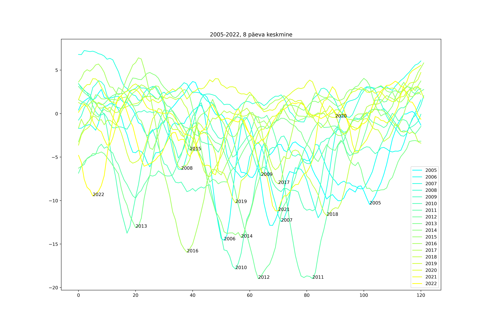
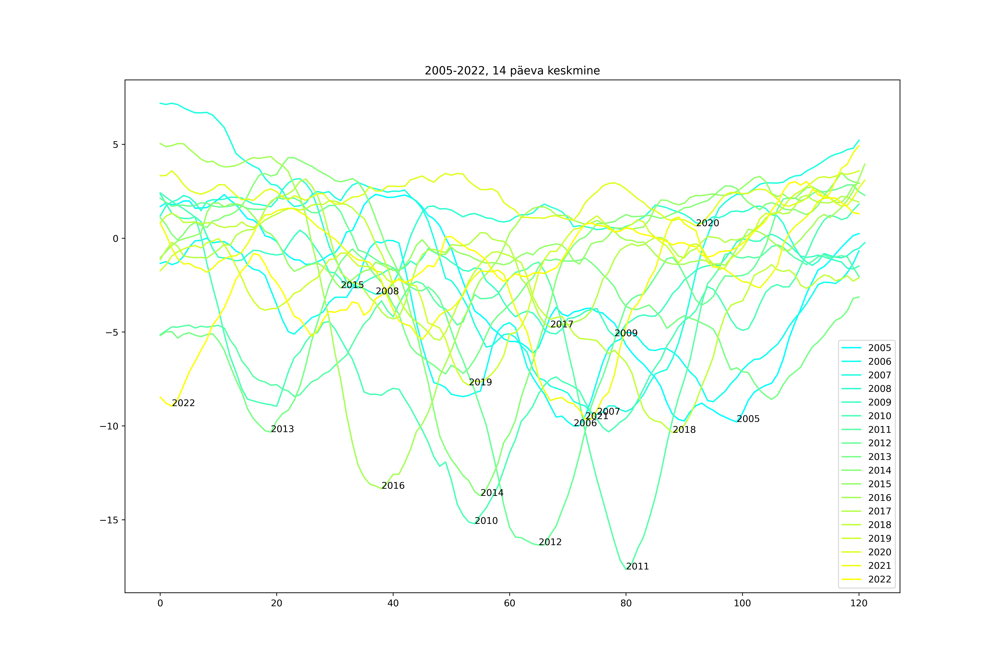
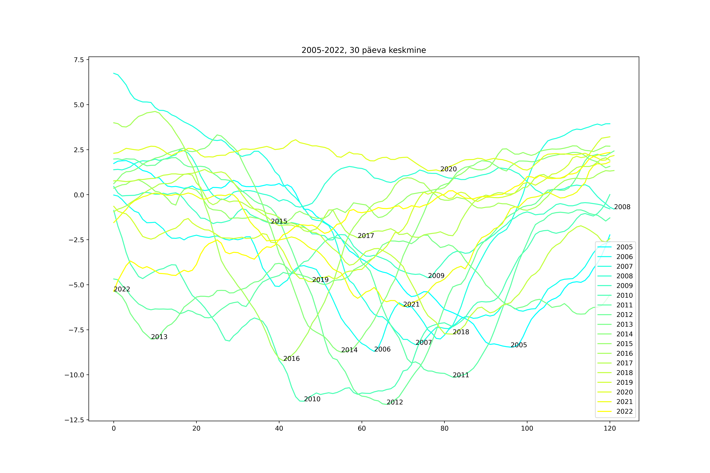
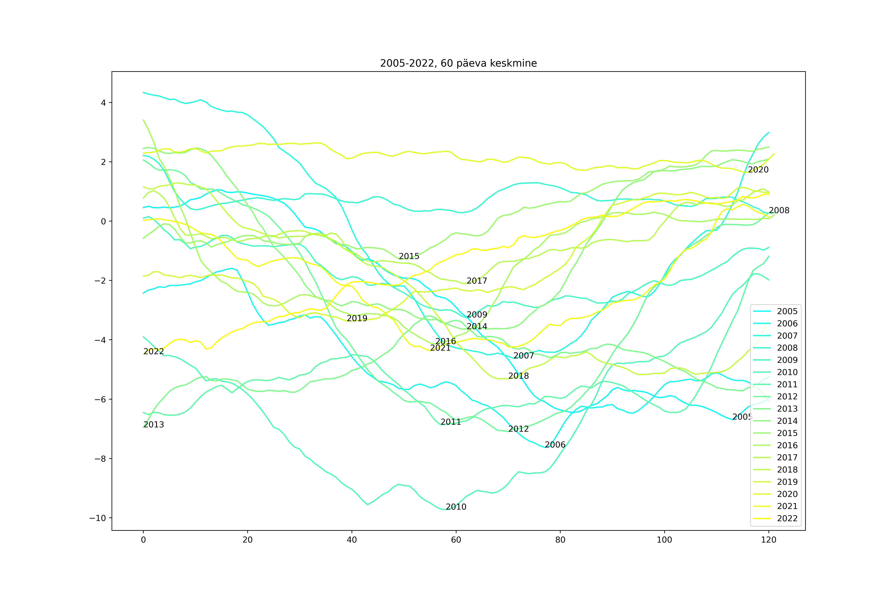

=Tallinna (Harku kandi) ilma keskmised meteostat andmete järgi=

Lugemisjuhend: iga joon näitab kindla aasta temperatuure detsembri algusest
märtsi lõpuni, iga andmepunkt on ümbritseva x päeva keskmine, nt 30 päeva
keskmisel graafil punkt nr 40 on päevade 25 kuni 55 keskmiste temperatuuride
keskmine. Iga aasta joonel on aastanumber lisatud ka vastava joone
miinimumpunkti paremaks loetavuseks.